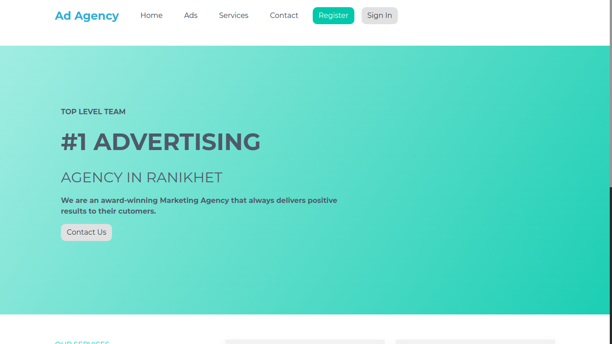

# Advertisement


## Local Setup

### Frontend Setup
- Clone frontend repo
https://github.com/prashantpandey9/advertisement.git

- ```cd advertiser```
- ```yarn```
- ```yarn start```
### Backend Setup
- Clone backend repo
https://github.com/prashantpandey9/Task-backend.git

- ```bundle install```
- ```rails db:migrate```
- ```rails db:seed```
- ```rails s```
